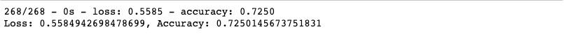
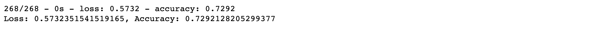
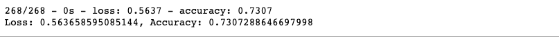
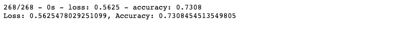
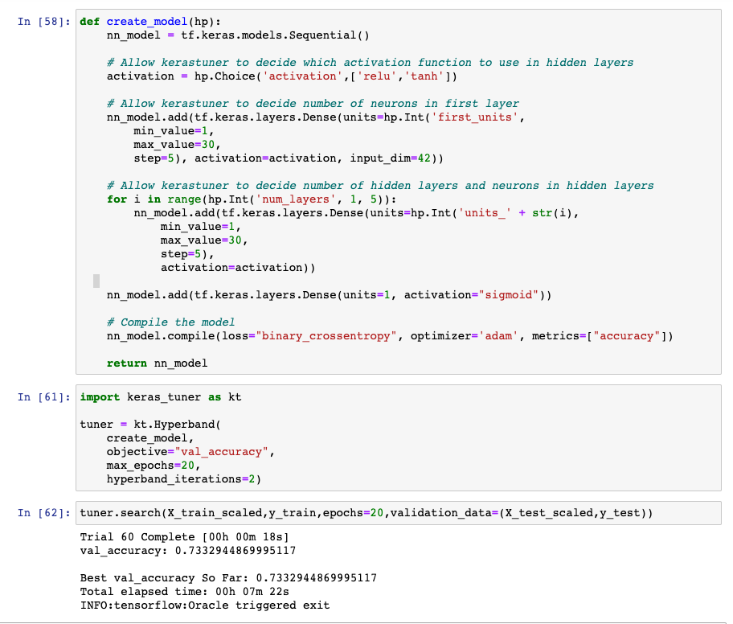
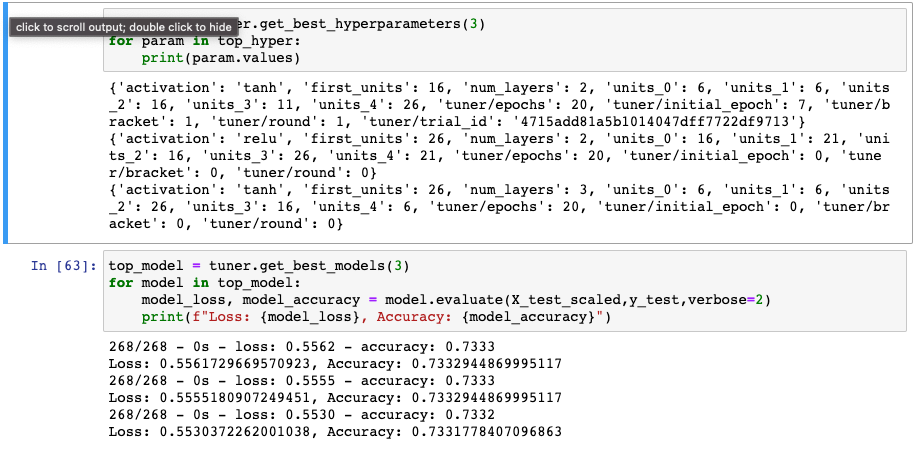

# Deep Learning: Charity Funding Predictor

## Overview

    Working for Alphabet Soup, the purpose of this analysis is to create an
    algorithm model to predict wheter or not applicants for funding will be
    succesfull. A CSV file with company's past funding data that contained over
    34,000 rows of data is used to train the model. Pandas is used to
    preproccess and import the data, Scikit Learn is used to standardize and
    split the data into train/test data, and Python's TenserFlow library is
    used to train and evaluate the data. 

## Results

    ### Data Pre-Processing
        * 'IS_SUCCESSFUL' column is the target for the model
        * 'EIN' and 'NAME' columns were removed since they had nothing significant
          to contribute to the model and would just confuse it.
        * The rest of the columns are considered features for the model. Object
          data types were one-hot encoded using pandas get_dummies function.
        * With the StandardScaler function of Scikit Learn, we standardize the data.
        
    ### Compiling, Training, and Evaluating the Model
    
        * For the first model, I used 2 layers, first with 80 nuerons and second
          with 30. Both had activation 'relu'. For output layer, I used 'sigmoid'
          activation. After compliling and fitting the model, we get the model loss
          and accuracy scores.
        

          
        * In order to optimize the model and get better predictions, in my first
          attempt I added more hidden layers and nuerons in attempt to improve the
          accuracy score. The accuracy scored did improve a little. 
        

        
        * In the second attempt, I changed the hidden layer activation to sigmoid
          and moved it around the layers. The score did improve but only marginaly.
        

        
        * In the final attempt to improve the score, I removed
         'SPECIAL_CONSIDERATIONS' and 'Status' columns from the dataset since that
          data is very skewed and seems unnecesery for the model. This did not
          change the outcome.
        

        
## Summary

    Even though the requested 75% accuracy score was not achieved, I got close with
    73%. A way to optimize the model better would be to get more data since it
    seems that with this data, the model tends to overfit the data. 
    
    Keras-Tuner was also used in the end to see what would be the optimal
    parameters for the model to achieve the highest accuracy score. Unfortunataly,
    even with this the top accuracy score is 73.3%.
    

